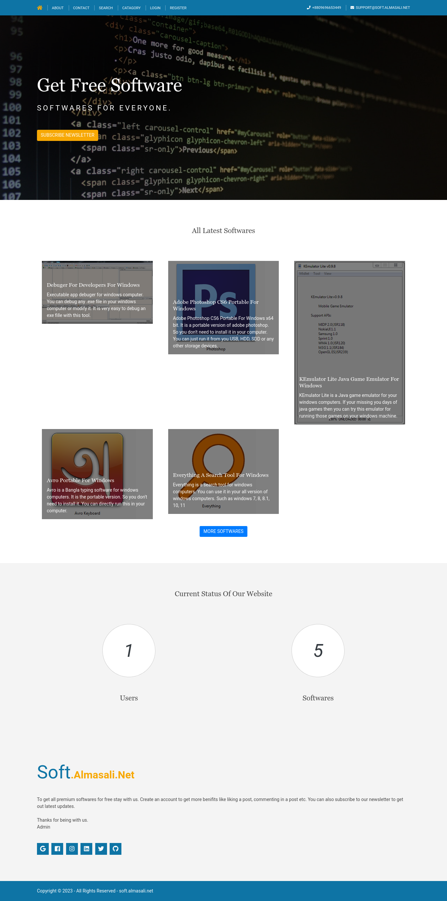

# Getsoftware - A Django practice project

First commited: `Sat Jun 19 16:55:21 2021 +0600`

Not actively maintained. Just a practice project. If you want to use it, you can.

How much bad my code was back in those days. I'm not even going to fix it. Just going to leave it as it is. For some security reasons, I have removed all previous commits in this public repo.

## Features

- User can register and login
- Admin can add software
- Admin can add category
- User can search software
- Suggestions are shown when user search
- User can download software
- User can comment on software after login
- User can reply to comments after login
- Download count is shown
- User can search software
- User can see software by category
- Modern UI
- Responsive

## Installation

```bash
# Clone the repo
git clone https://github.com/Almas-Ali/getsoftware && cd getsoftware

# Create virtual environment
python -m venv venv

# Activate virtual environment (Linux and Mac)
source venv/bin/activate

# Activate virtual environment (Windows)
venv\Scripts\activate

# Install requirements
pip install -r requirements.txt

# Run migrations
python manage.py migrate

# Create superuser (optional for admin panel)
# Only need when you want to add any software or category
python manage.py createsuperuser

# Run server
python manage.py runserver

```

Open http://127.0.0.1:8000 in your browser to see the app.

## Screenshots

### Home page



### Software page


### Contact page


### Category page


### Search page


### Register page


### Login page


### Search page


### Newsletter page


## License

[MIT](LICENSE)
